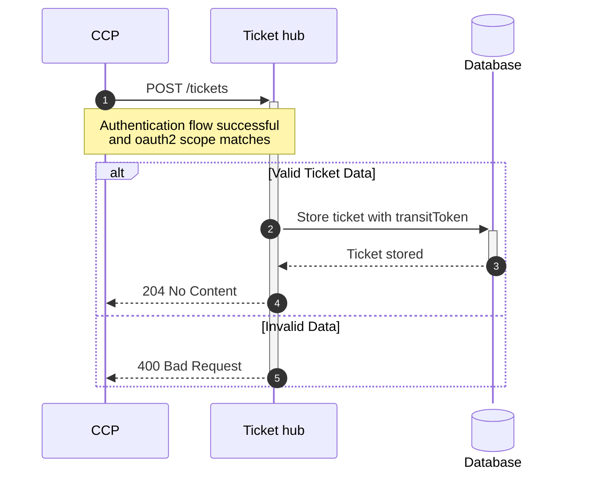
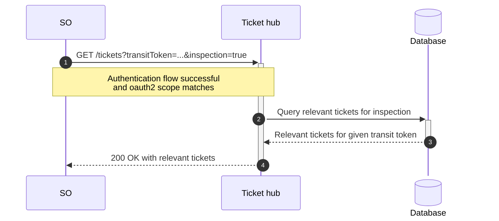
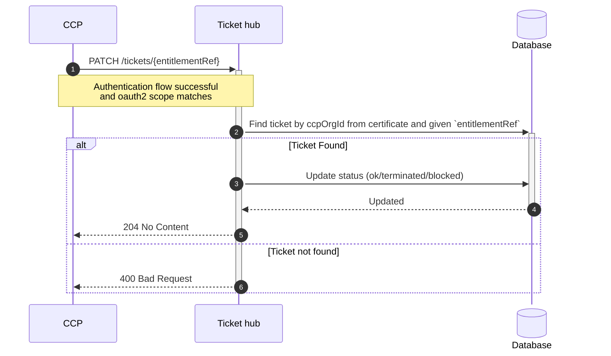
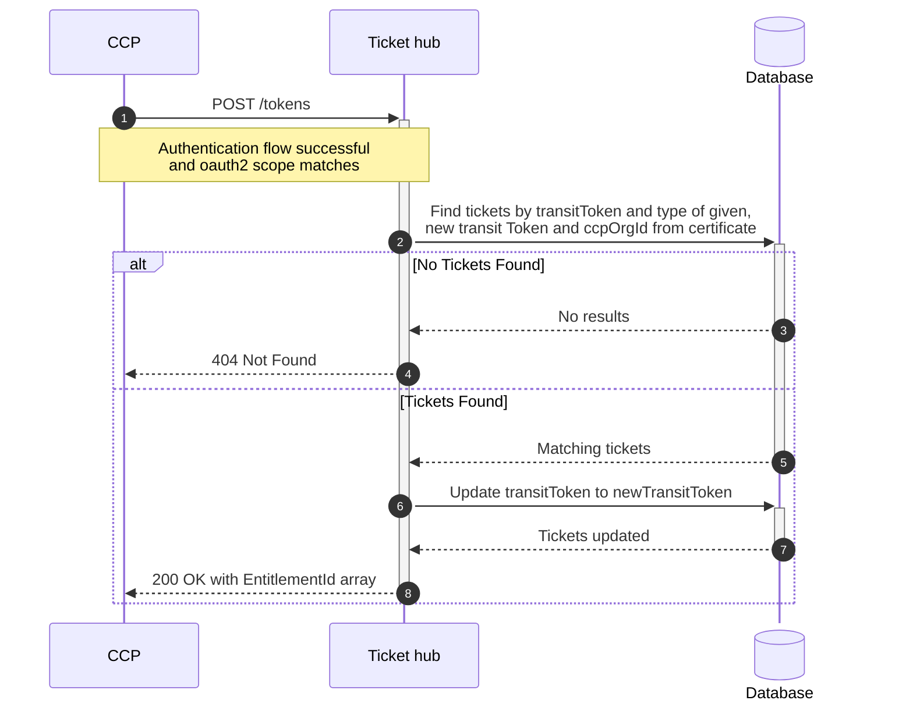
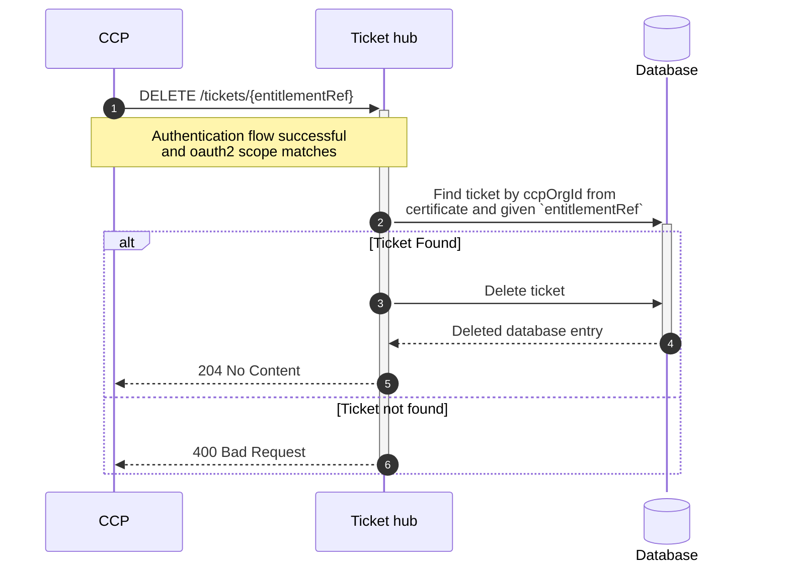

# Einleitung
Die HUSST-Gruppe wurde mit der Erstellung einer Spezifikation für eine offene Schnittstelle zu einem IDBT/ABT-Ticketspeicher betraut. Im folgenden sind fachliche Aspekte und Anwendungsfälle (use cases) aufgeführt, die wir für das Verständnis und die die Nutzung der Schnittstelle als relevant betrachten.  

# Festlegung und Abgrenzung
- Zur Nutzung des IDBT/ABT-Ticketspeichers ist eine Online-Verbindung nötig. Temporäre Netzausfälle sind daher z. B. durch Caching-Mechanismen bei den Backend-Systemen der Verkehrsunternehmen abzufangen.

- Die von der VDV-ETS vorgegebenen Strukturen zur Darstellung und Prüfung von Tickets können identisch übernommen werden. Das dabei benötigte Kontrollmodul muss weiterhin im Kontrollgerät mitgeführt werden.
  
- Es wird unterschieden zwischen Transit-Token (allgemeine ID für den Ticketspeicher) und Payment-Token (Bezahlung Kreditkarte), wobei der Ticketspeicher ausschließlich mit dem Transit-Token arbeitet. Dies bedeutet, dass bei Verwendung von Kreditkarten als Nutzermedium im Backend des Verkehrsunternehmens ein entsprechendes Mapping stattfinden muss. 

- Die Schnittstelle ist mandantenfähig und unterscheidet zwischen Verkehrsunternehmen (KVP) dahingehend, dass jedem Ticket eine OrgID und eine eindeutige Referenz zugeordnet wird.
  
- Die Schnittstelle bietet die Möglichkeit Tickets mit einer zeitlichen Gültigkeit und einem Status zu versehen - stellt darüber hinaus jedoch keine Funktionen zur Definition oder Berechnung von komplizierten Tariflogiken bereit. 
  
- Die Schnittstelle ist unabhängig von allen Bezahlprozessen und übernimmt keine Kunden- / Adress- oder Kontodaten - diese sind in den Backend-Systemen der Verkehrsunternehmen vorzuhalten.
  
- Die Schnittstelle bietet keine Möglichkeit der Fahrketten- / Preisbildung im Check-in / Check-out Verfahren.
  
# Anwendungsfall 1: Eintrag im Ticketspeicher
Ein Eintrag im Ticketspeicher erfolgt über die Funktion **POST /tickets**. Dabei wird das Ticket mit dem Status OK versehen.

## a) Verkauf Ticket
Hat ein Fahrgast(=Nutzer) ein Ticket (=spezielle Fahrberechtigung) erworben, so kann dieses im Ticketspeicher hinterlegt werden zusammen mit einer Identifikation (Transit-Token), die einem beim Fahrgast befindlichen Nutzermedium zugeordnet ist. Der Ticketspeicher erhält über ein Content-Feld die kompletten Ticketinformationen als Binärdaten. Der fachliche Inhalt der Binärdaten wird durch das Verkehrsunternehmen festgelegt und später entsprechend interpretiert. Das Nutzermedium kann z. B. eine einfache ID-Chipkarte, eine Kreditkarte, ein Smartphone, eine Smartwatch, ... usw. sein. Das Ticket kann anonym oder persönlich sein darüber hinaus eine Einzelfahrkarte oder eine Zeitkarte beinhalten. Auch Mehrfahrtenkarten sind möglich, wobei die Schnittstelle jedoch keine expliziten Funktionen zur Entwertung einzelner Abschnitte anbietet - dies kann aber über die innere Struktur der Berechtigung realisiert werden.
Das Ticket kann Prepaid oder Postpaid bezahlt werden.

## b) Ausgabe Nutzungsberechtigung
Möchte ein Fahrgast an einem CiCo-Verfahren teilnehmen, so kann dieses durch die Ausgabe einer AFB (=allgemeinen Fahrberechtigung) im Ticketspeicher dokumentiert werden. Die Ausgabe erfolgt analog dem Verkauf eines Tickets (siehe a). Weitere spezielle Angaben insbesondere Daten zum hinterlegten Bankkonto des Fahrgastes werden nicht im Ticketspeicher abgelegt sondern sind im jeweiligen Backendsystem des Verkehrsunternehmens zu pflegen.

## c) Nutzung Check-in oder Check-out (Ausblick)
Die Dokumentation der Entwertung bei Einstieg / Fahrtbeginn durch einen Check-in-Datensatz bzw. analog beim Ausstieg / Fahrtende durch einen Check-out-Datensatz erfolgt ebenfalls analog dem Verkauf eines Tickets (siehe a). 

# Sequenzdiagram: Ticket zum Ticketspeicher hinzufügen

# Anwendungsfall 2: Kontrolle
Für die Kontrolle wird der Ticketspeicher ausgelesen über die Funktion **GET /tickets**. Bei der Kontrolle sind verschiedene Fälle zu unterscheiden

## a) automatische Kontrolle
Die automatische Kontrolle findet an einer Stele oder einem anderen statischen oder mobilen Kontrollgerät statt. Sie öffnet z. B. automatisch ein Tor (Gate) oder zeigt eine grüne oder rote Lampe an. Dazu wird die Identifikation vom Nutzermedium gelesen und damit eine Anfrage an den Ticketspeicher gestellt, der daraufhin alle als aktiv gekennzeichneten Tickets (Status OK oder GESPERRT) des Fahrgastes zurückliefert. Die Prüfung, ob das Ticket tatsächlich räumlich und zeitlich gültig ist gem. der geltenden Tarifbestimmungen bzw. was im Fall eine gesperrten Tickets passiert obliegt der Software des Kontrollgerätes. 

## b) personalbediente Kontrolle
Bei der personalbedienten Kontrolle wird mittels eines Kontrollgerätes die Identifikation vom Nutzermedium gelesen und damit eine Anfrage an den Ticketspeicher gestellt, der daraufhin alle als aktiv gekennzeichneten Tickets (Status OK oder GESPERRT) des Fahrgastes zurückliefert. Die Informationen, die im Ticketspeicher mit dem Verkauf abgelegt wurden, werden am Kontrollgerät sichtbar gemacht (z. B. "gültig bis 14:25 h", "gültig in Zone 3", ...). Die Prüfung, ob das Ticket tatsächlich räumlich und zeitlich gültig ist gem. der geltenden Tarifbestimmungen kann vom Kontrollgerät automatisch (siehe a) oder vom Prüfpersonal (als Sichtkontrolle) durchgeführt werden.

## c) interoperable Kontrolle
Bei Einsatz von Kreditkarten als Nutzermedium ist eine einheitliche Erzeugung von Transit-Tokens für alle teilnehmenden Hersteller zu vereinbaren.

## Sequenzdiagramm: Ticket aus Ticketspeicher abrufen

# Anwendungsfall 3: Tickets aktualisieren / sperren

## a) Stammdatenänderung
Tickets die bereits zum Ticketspeicher hinzugefügt wurden können aktualisiert werden. Dazu kann das Ticket über die Funktion **PATCH /tickets** im Ticketspeicher aktualisiert werden um beispielsweise die Gültigkeit eines Tickets zu verändern.

## b) Sperre: Nutzer soll Ticket nicht mehr nutzen
Hat ein Nutzer seine Rechnung nicht bezahlt oder soll er aus anderem Grund ein Ticket nicht mehr nutzen, so kann es gesperrt werden. Dazu kann die entsprechende Funktion genutzt werden, der das Verkehrsunternehmen seine OrgID sowie die eindeutige Referenz des Tickets und den Status "GESPERRT" übergibt. Entfällt der Sperrgrund, so kann der Status auf "OK" zurückgestellt werden.

## c) Sperre: Nutzermedium verloren oder gestohlen
Geht das Nutzermedium verloren oder wird gestohlen, so soll Missbrauch vorgebeugt werden, wobei alle zu einem Transit-Token gehörenden Tickets eines Verkehrsunternehmens über die entsprechende Funktion den Status "GESPERRT" erhalten können. Wird es wiedergefunden, so kann der Status auf "OK" zurückgestellt werden - im anderen Fall wäre das Ticket zu löschen (s.u. Anwendungsfall 7). Es ist zu klären, in wie weit ein Verkehrsunternehmen auch Tickets anderer Verkehrsunternehmen auf diesem Wege sperren darf.

## Sequenzdiagramm: Update von Tickets mittels Entitlement

# Anwendungsfall 4: Ersatzkarte (Ticket auf neues Medium)
Soll eine Ersatzkarte / Ersatzmedium für ein verloren gegangenes oder defektes Medium erstellt werden, so kann auch im Ticketspeicher ein entsprechender Austausch vorgenommen werden. Dabei wird die Funktion **POST /tokens** aufgerufen, die sowohl das alte als auch das neue Transit-Token erhält. Im Ticketspeicher werden dann alle Tickets mit Status OK dem neuen Transit-Token zugeordnet. Es ist zu klären, in wie weit ein Verkehrsunternehmen auch Tickets anderer Verkehrsunternehmen auf diesem Wege neu zuordnen können soll.

# Anwendungsfall 5: Check-in / Check-out Nutzung
Soll eine Nutzung im Rahmen eines Check-in- / Check-out-Verfahrens ein Ein- oder Ausstieg dokumentiert werden, so kann dieser im Ticketspeicher analog eines Verkaufs abgelegt werden ([Anwendungsfall 1](#anwendungsfall-1-eintrag-im-ticketspeicher)). Bei der Kontrolle erfolgt dabei wie oben beschrieben ([Anwendungsfall 2](#anwendungsfall-2-kontrolle)), wobei die Gültigkeitsprüfung auf den letzten gültigen Check-in auf den kein Check-out folgt stattfinden kann und dies dann analog der Prüfung eines Einzelfahrscheins. 

# Anwendungsfall 6: Ticket löschen
Wird ein Ticket nicht mehr benötigt, weil es z. B. nicht mehr gültig ist und auch bei der Anzeige bei der personalbedienten Kontrolle nicht mehr erscheinen soll, so kann es über die Funktion **DELETE /tickets** aus dem Ticketspeicher gelöscht werden.

 

 
