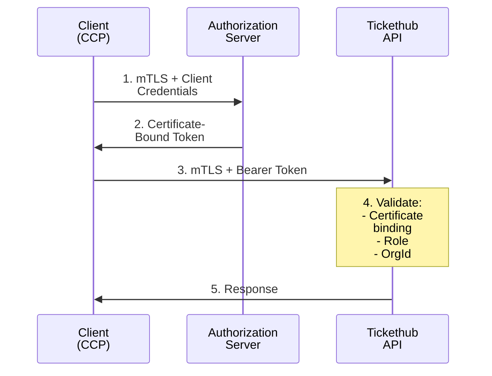
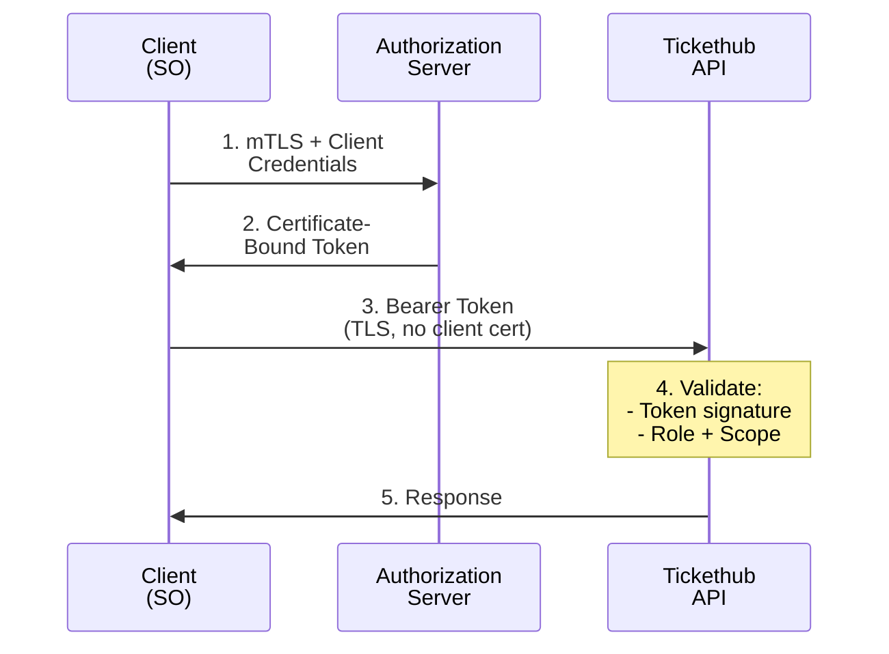

# Authorization and Authentication

This document describes the security architecture for the HUSST Tickethub API.

## Security Model Overview

The Tickethub API uses OAuth 2.0 with certificate-bound JWT Bearer Tokens in combination with mutual TLS (mTLS).
Access tokens are bound to the client’s X.509 certificate by the authorization server ([RFC 8705](https://datatracker.ietf.org/doc/html/rfc8705)), ensuring they can only be used by the issuing client.

 - **Create, Update, and Delete operations (POST, PATCH, DELETE)**: JWT Bearer Token and mTLS
 - **View and Validation operations (GET)**: JWT Bearer Token (certificate-bound)

## VDV-KA Certificate Subject DN Format

Client certificates follow the VDV-KA PKI structure with the following Subject Distinguished Name format:

### Example

```
CN=dl44.rheinbahn.de, O=002C, C=DE
```

### Subject Components

| Field | Example | Description |
|-------|---------|-------------|
| CN | `dl44.rheinbahn.de` | `{role}{vdv_org_id_decimal}.{domain}` |
| O | `002C` | vdv_org_id in hexadecimal |
| C | `DE` | Country code (ISO 3166-1 alpha-2) |

### Common Name (CN) Structure

The CN encodes the role and organization identifier:

- **Role prefix**: Variable length (2-3 characters) identifying the VDV-KA business role
- **Org ID**: Decimal representation of the organization's VDV-KA identifier
- **Domain**: The organization's domain name

Parsing logic: Extract characters until the first digit to determine the role, then extract digits until the dot to get the org_id.

```
CN = "kvp35000.example-transport.de"
     └─┬─┘└──┬──┘└────────┬────────┘
     role  org_id       domain
```

## VDV-KA Business Roles

| Role Code | German | English | Description |
|-----------|--------|---------|-------------|
| `dl` | Dienstleister | Service Operator (SO) | Transport operators performing ticket inspection |
| `kvp` | Kundenvertragspartner | Customer Contract Partner (CCP) | Organizations issuing and managing tickets |
| `pv` | Produktverantwortlicher | Product Owner (PO) | Tariff authorities managing

## Role-Based Access Control

### Permission Matrix

| Operation | SO | CCP | PO | Description |
|-----------|:--:|:---:|:--:|-------------|
| Create ticket (POST /tickets) | - | X | - | Store new ticket |
| Validate token (GET /tickets) | X | X | - | Retrieve valid tickets from token |
| Get tickets from token (GET /tickets) | X | X | - | Retrieve all tickets from token |
| Read ticket (GET /tickets/{ticketRef}) | - | X | - | Retrieve ticket information from ticketRef |
| Update tickets (PATCH /tickets/{ticketRef}) | - | X | - | Modify ticket status |
| Delete tickets (DELETE /tickets/{ticketRef}) | - | X | - | Remove ticket |
| Replace token (POST /tokens) | - | X | - | Reassign tickets to new token |

### OrgId Validation Rules

| Role | Read Access | Write Access |
|------|-------------|--------------|
| SO | All tickets (required for inspection) | None |
| CCP | Own OrgId tickets only | Own OrgId tickets only |
| PO | No read access | No write access |

## OAuth2 Scopes

| Scope | Description | Granted to Roles |
|-------|-------------|------------------|
| `view:token` | View ticket information from token | SO, CCP |
| `validate:token` | Validate tickets from token | SO, CCP |
| `replace:token` | Replace token by a new one | CCP |
| `view:ticket` | View ticket information from ticket reference | CCP |
| `create:ticket` | Create tickets for token | CCP |
| `update:ticket` | update ticket from ticket reference | CCP |
| `delete:ticket` | delete tickets from ticket reference | CCP |

## RFC 8705: Certificate-Bound Access Tokens

### Token Binding Mechanism

When a client authenticates via mTLS at the token endpoint, the authorization server binds the issued access token to the client's certificate by including a `cnf` (confirmation) claim with the certificate's SHA-256 thumbprint:

```json
{
  "iss": "https://auth.tickethub.example.com",
  "sub": "dl35000",
  "aud": "https://api.tickethub.example.com",
  "exp": 1735689600,
  "scope": "view:token validate:token",
  "vdv_role": "dl",
  "vdv_org_id": 35000,
  "cnf": {
    "x5t#S256": "fUHyO2r2Z3DZ53EsNrWBb0xWXoaNy59IiKCAqksmQEo"
  }
}
```

The `x5t#S256` value is a base64url-encoded SHA-256 hash of the DER-encoded X.509 certificate.

### Custom Claims

| Claim | Type | Description |
|-------|------|-------------|
| `vdv_role` | string | VDV-KA role extracted from certificate CN (`dl`, `kvp`, `pv`) |
| `vdv_org_id` | integer | Organization ID extracted from certificate CN or O field |

### Protected Resource Validation

When a client presents a certificate-bound token to the API:

1. Extract the client certificate from the TLS connection
2. Compute the SHA-256 hash of the DER-encoded certificate
3. Compare against the `x5t#S256` value in the token's `cnf` claim
4. **Reject the request if hashes do not match**

This ensures that stolen tokens cannot be used without the corresponding private key.

## JWT Structure

Access tokens are JSON Web Tokens (JWT) as defined in [RFC 7519](https://datatracker.ietf.org/doc/html/rfc7519). Each JWT consists of three base64url-encoded parts separated by dots: `header.payload.signature`.

### Header

```json
{
  "alg": "RS256",
  "typ": "at+jwt",
  "kid": "tickethub-signing-key-2025"
}
```

| Field | Description |
|-------|-------------|
| `alg` | Signing algorithm. RS256 (RSA with SHA-256) is required. |
| `typ` | Token type. `at+jwt` indicates an access token per [RFC 9068](https://datatracker.ietf.org/doc/html/rfc9068). |
| `kid` | Key ID referencing the public key in the JWKS for signature verification. |

### Payload (Claims)

The payload contains both standard JWT claims and VDV-KA-specific custom claims:

```json
{
  "iss": "https://auth.tickethub.example.com",
  "sub": "dl44",
  "aud": "https://api.tickethub.example.com",
  "exp": 1735689600,
  "iat": 1735686000,
  "nbf": 1735686000,
  "jti": "a1b2c3d4-e5f6-7890-abcd-ef1234567890",
  "scope": "view:token validate:token",
  "vdv_role": "dl",
  "vdv_org_id": 44,
  "cnf": {
    "x5t#S256": "fUHyO2r2Z3DZ53EsNrWBb0xWXoaNy59IiKCAqksmQEo"
  }
}
```

#### Standard Claims

| Claim | Type | Description |
|-------|------|-------------|
| `iss` | string | Issuer URL of the authorization server |
| `sub` | string | Subject identifier (client ID, typically `{role}{org_id}`) |
| `aud` | string | Audience - the resource server URL |
| `exp` | integer | Expiration time (Unix timestamp) |
| `iat` | integer | Issued at time (Unix timestamp) |
| `nbf` | integer | Not valid before time (Unix timestamp) |
| `jti` | string | Unique token identifier (UUID) for revocation tracking |
| `scope` | string | Space-separated list of granted scopes |

#### Custom Claims (VDV-KA)

| Claim | Type | Description |
|-------|------|-------------|
| `vdv_role` | string | VDV-KA role extracted from certificate CN (`dl`, `kvp`, `pv`) |
| `vdv_org_id` | integer | Organization ID extracted from certificate CN or O field |
| `cnf` | object | Confirmation claim for certificate binding (RFC 8705) |

## OpenID Connect (OIDC)

The authorization server implements OpenID Connect Discovery 1.0 to enable automatic client configuration.

### Discovery Endpoint

Clients retrieve the authorization server metadata from:

```
GET https://auth.tickethub.vdv.de/.well-known/openid-configuration
```

Example response:

```json
{
  "issuer": "https://auth.tickethub.vdv.de",
  "token_endpoint": "https://auth.tickethub.vdv.de/oauth2/token",
  "jwks_uri": "https://auth.tickethub.vdv.de/.well-known/jwks.json",
  "introspection_endpoint": "https://auth.tickethub.vdv.de/oauth2/introspect",
  "revocation_endpoint": "https://auth.tickethub.vdv.de/oauth2/revoke",
  "scopes_supported": ["view:token", "validate:token", "replace:token", "create:ticket", "update:ticket", "delete:ticket", "view:ticket", "offline_access"],
  "response_types_supported": ["token"],
  "grant_types_supported": ["client_credentials", "refresh_token"],
  "token_endpoint_auth_methods_supported": ["tls_client_auth"],
  "tls_client_certificate_bound_access_tokens": true,
  "mtls_endpoint_aliases": {
    "token_endpoint": "https://mtls.auth.tickethub.vdv.de/oauth2/token"
  }
}
```

### Token Endpoint

Clients obtain access tokens using the `client_credentials` grant with mTLS authentication:

```
POST https://mtls.auth.tickethub.example.com/oauth2/token
Content-Type: application/x-www-form-urlencoded

grant_type=client_credentials&scope=view:token%20validate:token
```

The client authenticates via its X.509 certificate presented during the TLS handshake.

Example response:

```json
{
  "access_token": "eyJhbGciOiJSUzI1NiIsInR5cCI6ImF0K2p3dCIsImtpZCI6InRpY2tldGh1Yi1zaWduaW5nLWtleS0yMDI1In0...",
  "token_type": "Bearer",
  "expires_in": 3600,
  "refresh_token": "dGhpcyBpcyBhIHJlZnJlc2ggdG9rZW4...",
  "scope": "view:token validate:token"
}
```

### JWKS Endpoint

The JSON Web Key Set (JWKS) endpoint provides the public keys for verifying access token signatures:

```
GET https://auth.tickethub.example.com/.well-known/jwks.json
```

Example response:

```json
{
  "keys": [
    {
      "kty": "RSA",
      "use": "sig",
      "kid": "tickethub-signing-key-2025",
      "alg": "RS256",
      "n": "0vx7agoebGcQSuuPiLJXZptN9nndrQmbXEps2aiAFbWhM78LhWx4cbbfAAtVT86zwu1RK7aPFFxuhDR1L6tSoc_BJECPebWKRXjBZCiFV4n3oknjhMstn64tZ_2W-5JsGY4Hc5n9yBXArwl93lqt7_RN5w6Cf0h4QyQ5v-65YGjQR0_FDW2QvzqY368QQMicAtaSqzs8KJZgnYb9c7d0zgdAZHzu6qMQvRL5hajrn1n91CbOpbISD08qNLyrdkt-bFTWhAI4vMQFh6WeZu0fM4lFd2NcRwr3XPksINHaQ-G_xBniIqbw0Ls1jF44-csFCur-kEgU8awapJzKnqDKgw",
      "e": "AQAB"
    }
  ]
}
```

Resource servers must cache the JWKS response and refresh it periodically or when encountering an unknown `kid`.

### Token Introspection

For opaque tokens or additional validation, the introspection endpoint provides token metadata:

```
POST https://auth.tickethub.example.com/oauth2/introspect
Content-Type: application/x-www-form-urlencoded

token=eyJhbGciOiJSUzI1NiIs...
```

## Token Lifecycle

### Expiration

- **Access tokens**: Short-lived, typically 1 hour (`expires_in: 3600`)
- **Refresh tokens**: Longer-lived, typically 24 hours to 7 days depending on security requirements
- Clients must check the `exp` claim and refresh tokens before expiration
- Resource servers should allow a clock skew tolerance of 30-60 seconds

### Refresh Token Flow

To obtain a new access token without re-authenticating via mTLS:

```
POST https://mtls.auth.tickethub.example.com/oauth2/token
Content-Type: application/x-www-form-urlencoded

grant_type=refresh_token&refresh_token=dGhpcyBpcyBhIHJlZnJlc2ggdG9rZW4...
```

The refresh request must still be made over the mTLS connection to maintain certificate binding. The new access token will be bound to the same certificate.

To use refresh tokens, include `offline_access` in the initial scope request.

### Token Revocation

Clients can revoke tokens (e.g., on logout or credential rotation):

```
POST https://auth.tickethub.example.com/oauth2/revoke
Content-Type: application/x-www-form-urlencoded

token=eyJhbGciOiJSUzI1NiIs...&token_type_hint=access_token
```

Resource servers should implement token revocation checks for high-security operations.

## Authorization Flow

### Create, Update and Delete (CUD) operations (mTLS Required)



### View and Validation Operations (Bearer Token Only)



## Error Responses

### 401 Unauthorized

Returned when:

- No Bearer token provided
- Token is expired or invalid
- Token signature verification fails

### 403 Forbidden

Returned when:

- Role is not authorized for the operation
- OrgId in request does not match OrgId from certificate
- Certificate binding validation fails (for write operations)

Example error response:

```json
{
  "type": "https://api.example.com/problems/insufficient-permissions",
  "title": "Insufficient permissions",
  "status": 403,
  "detail": "The ticket cannot be stored because the ccpOrgId does not match the OrgId from the client certificate.",
  "instance": "/tickets"
}
```

## References

- [RFC 6749: The OAuth 2.0 Authorization Framework](https://datatracker.ietf.org/doc/html/rfc6749)
- [RFC 7517: JSON Web Key (JWK)](https://datatracker.ietf.org/doc/html/rfc7517)
- [RFC 7519: JSON Web Token (JWT)](https://datatracker.ietf.org/doc/html/rfc7519)
- [RFC 8705: OAuth 2.0 Mutual-TLS Client Authentication and Certificate-Bound Access Tokens](https://datatracker.ietf.org/doc/html/rfc8705)
- [RFC 9068: JSON Web Token (JWT) Profile for OAuth 2.0 Access Tokens](https://datatracker.ietf.org/doc/html/rfc9068)
- [OpenID Connect Core 1.0](https://openid.net/specs/openid-connect-core-1_0.html)
- [OpenID Connect Discovery 1.0](https://openid.net/specs/openid-connect-discovery-1_0.html)
- [OpenAPI 3.1 Security Schemes](https://spec.openapis.org/oas/v3.1.0#security-scheme-object)

