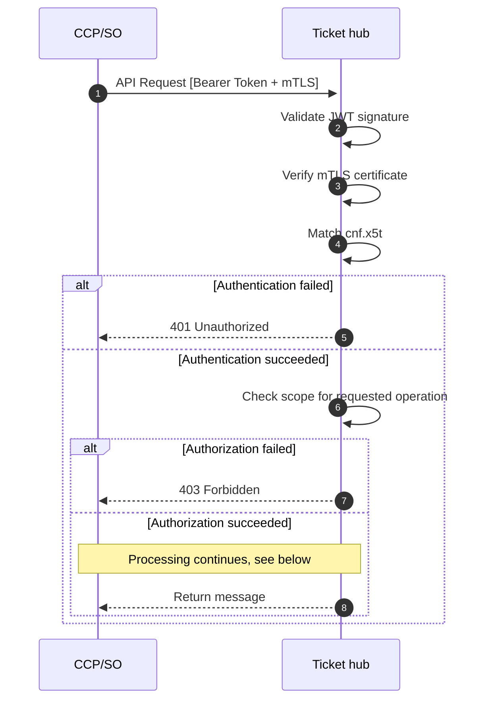

# HUSST Tickethub API
## Overview

The HUSST Tickethub API provides secure management of tickets associated with transit tokens. It enables transit operators and partners to:

- **Store and update tickets** linked to transit tokens
- **Retrieve ticket information** for inspection and validation
- **Manage the ticket lifecycle** including terminating, deleting, or reassigning tickets

## Transit Token

The API supports different transit token schemes. Each transit token is always handled together with an explicit `tokenType`.

The default and currently supported token type is `iso24851`. Support for additional token types must be requested and approved via this repository.

A transit token is represented as a **typed transit token**, consisting of:
- `tokenType`: Identifies the token scheme
- `transitToken`: The token value encoded as Base64url

### Matching rules

Ticket lookup and validation apply token-type-specific matching rules.

For `iso24851`, matching rules depend on the tokenization method defined by the ISO 24851 standard. These rules are applied internally by the Tickethub when resolving tickets for a given transit token.


## Ticket

A ticket is a composite of structured data that is available for interpretation for the ticket hub and a ticket container which is not interpreted by the ticket hub. It allows to filter the tickets for relevance when an inspection requests tickets for inspection.
The ticket container's format can be freely chosen by the different parties (CCP, SO).

### Structured data

Ticket data is separated conceptually into **write-time data** (ticket creation) and **read-time data** (retrieved tickets).

### Ticket creation (write)

When creating a ticket, the client must provide:
- `status`
- `expirationTime`
- `entitlement` (container data)

If not specified explicitly:
- `effectiveTime` defaults to the creation time

### Retrieved tickets (read)

When tickets are retrieved from the API, the structured data additionally contains:
- `entitlementId` (including `ccpOrgId`)
- `status`
- `effectiveTime`
- `expirationTime`
- `entitlement` (container data)

All fields except `status` are immutable.

### Container

The container is the part of the ticket that allows the CCP to store entitlement data in any previously agreed format.
It may contain information such as spatial validity or complex temporal rules that are not interpreted by the Tickethub itself.

The container format SHOULD be indicated using the `contentType` field.
It is recommended to use well-known ticket formats to ensure compatibility with inspection devices.

## API Endpoints

The API endpoints provide access to the ticket storage, which is essentially a highly available database augmented by a lightweight, versatile, domain-specific layer that models tickets and tokens and enforces client-specific read and write permissions.

### Tickets

| Method | Endpoint | Operation | Required Scope |
|--------|----------|-----------|----------------|
| `POST` | `/tickets` | Create new ticket | `create:ticket` |
| `GET` | `/tickets` | Retrieve tickets for a transit token | `view:token` or `validate:token` |
| `PATCH` | `/tickets/{entitlementRef}` | Update a single ticket | `update:ticket` |
| `DELETE` | `/tickets/{entitlementRef}` | Delete a single ticket | `delete:ticket` |

### Tokens

| Method | Endpoint | Operation | Required Scope |
|--------|----------|-----------|----------------|
| `POST` | `/tokens` | Replace transit token | `replace:token` |


### General Authentication Flow

This flow illustrates the authentication and authorization process that precedes all API operations. If either step fails, the corresponding error response is returned immediately. The endpoint-specific flows below assume successful authentication.



## Data Models

### Ticket

```json
{
  "uuid": "123e4567-e89b-12d3-a456-426614174000",
  "depositedAt": "2025-12-01T10:00:00Z",
  "ticketData": {
    "entitlementId": {
      "ccpOrgId": 35000,
      "entitlementRef": "987654321"
    },
    "depositedAt": "2025-12-08T11:50:00Z",
    "effectiveTime": "2025-12-08T12:00:00Z",
    "expirationTime": "2025-12-31T23:59:59Z",
    "status": "ok",
    "entitlement": {
      "contentType": "tlvEfs",
      "content": "d2F0Y2g/dj14dkZaam81UGdHMA=="
    }
  }
}

```

### Entitlement Content Types

| Type | Description |
|------|-------------|
| `tlvEfs` | TLV EFS format |
| `referenzEfs` | Reference EFS format |
| `referenzPobPeb` | Reference POB/PEB format |
| `referenzEfsStb` | Reference EFS STB format |
| `eticoreEt` | eTicore ET format |
| `unspecified` | Unspecified format (default) |

### OrgId

Organization IDs range from `0` to `35067`.

## Response Codes

| Code | Description |
|------|-------------|
| `200` | Success (with response body) |
| `204` | Success (no content - operation successful) |
| `400` | Bad Request - Invalid input data |
| `401` | Unauthorized - Authentication failed |
| `403` | Forbidden - Authorization failed (e.g., OrgId mismatch) |
| `404` | Not Found - Resource does not exist |
| `500` | Internal Server Error |


## Error Handling

All error responses follow this structure:

```json
{
  "code": 123,
  "message": "Descriptive error message"
}
```

### Common Error Scenarios

| Scenario | Code | Description/Example |
|----------|------|-----------------|
| Missing auth token | 1 | Authentication required. |
| Invalid OrgId | 2 | Invalid OrgId. |
| Certificate mismatch | 3 | Insufficient permissions to store this ticket as ccpOrgId doesn't match OrgId from certificate. |
| Missing Scope | 5 | Insufficient permissions to for the requested operation and the provided scope. |
| Ticket not found | 4 | Ticket number not found. |


## Encoding

### Base64url

Transit tokens use URL-safe Base64 encoding as defined in [RFC 4648 Section 5](https://datatracker.ietf.org/doc/html/rfc4648#section-5):
- Character set: `A-Z`, `a-z`, `0-9`, `-`, `_`
- No padding characters (`=`)
